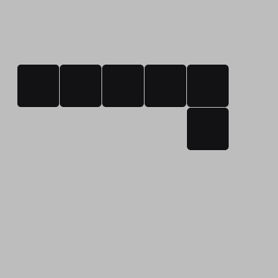
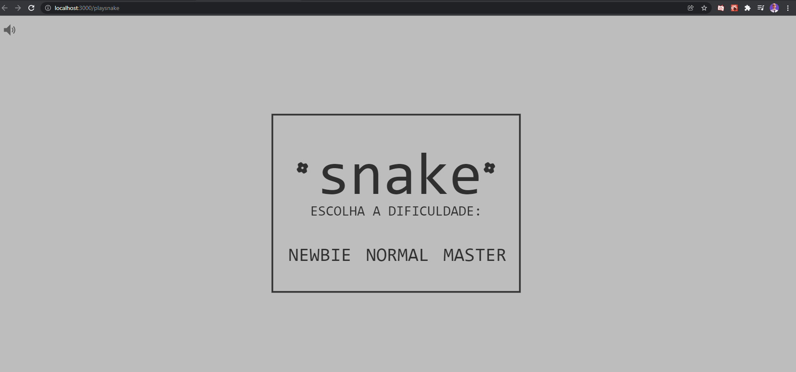
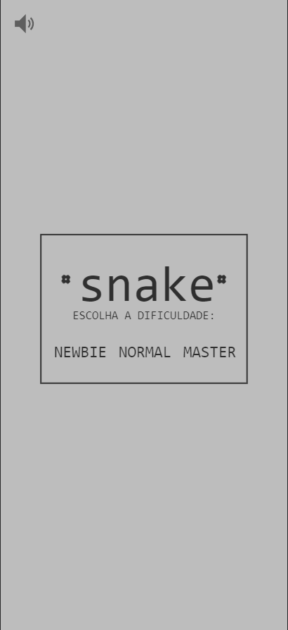

<h1 align="center">
    PlaySnake<br> 
</h1>
<div align="center">
     
        
</div>
    
<p align="center">   
    
</p>
<p align="center">
  <a href="#sobre">Sobre</a>&nbsp;&nbsp;&nbsp;|&nbsp;&nbsp;&nbsp;
  <a href="#tecnologias">Tecnologias</a>&nbsp;&nbsp;&nbsp;|&nbsp;&nbsp;&nbsp;
  <a href="#como-executar">Como Executar</a>&nbsp;&nbsp;&nbsp;|&nbsp;&nbsp;&nbsp;
  <a href="#licença">Licença</a>
</p>

## Sobre

Está é uma aplicação Web feita do jogo Clássico Snake que tinha nos celulares da Nokia, você também pode ajudar a este projeto. Então bora codar e divirta-se com o joguinho. 👨‍💻🙂

## Tecnologias

- [Typescript](https://www.typescriptlang.org/)
- [ReactJS](https://reactjs.org/)

## Como Executar

- ### **Pré-requisitos**

  - É **necessário** possuir o **[Node.js](https://nodejs.org/en/)** instalado no computador
  - É **necessário** possuir o **[Git](https://git-scm.com/)** instalado e configurado no computador
  - Também, é **preciso** ter um gerenciador de pacotes seja o **[NPM](https://www.npmjs.com/)** ou **[Yarn](https://yarnpkg.com/)**.

1. Faça um clone do repositório:

```sh
  $ git remote add origin git@github.com:aleksanderpalamar/playsnake.git
```

2. Executando a Aplicação:

```sh
  # Aplicação web
  $ cd playsnake
  # Instalando as dependências do projeto.
  $ yarn # ou npm install
  # Inicie a aplicação web
  $ yarn start # ou npm start
```

---

<sup>Projeto desenvolvido por [Aleksander Palamar](https://github.com/aleksanderpalamar), da [Blog](https://app.linuxupdate.com.br).</sup>
